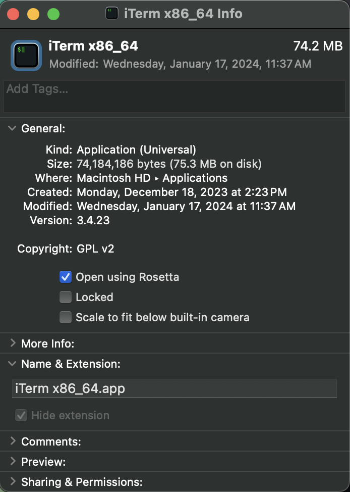
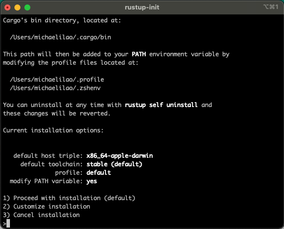

# Setting up Hugging Face Transformers on Mac OS M1/M2 Chips

Setting up Python environments is a pain, matching all the package versions and hardware requirements is a nightmare. In this tutorial, I will show you the steps I took to run Hugging face transformers locally on my M2 Macbook. (Will work on any Apple Silicon chips).

## 1. Terminal Setup

First step we will need to take is switching from *arm64* to *i386*. We can do this by creating a duplicate of your terminal application (I use iTerm and named the duplicate iTerm x86_64) and setting it to *Open using Rosetta*.



Open your newly created terminal and run the following command to check it worked

```sh
arch
```

Output should say *i386* instead of *arm64*

## 2. Downloading and Installing Rust

In your new terminal run the following commands to download rust 

```sh
curl --proto '=https' --tlsv1.2 -sSf https://sh.rustup.rs | sh
```
As per https://www.rust-lang.org/tools/install.



Ensure *default host triple* is *x86_64-apple-darwin*.

## 3. Python Environment
We will be using conda to manage our virtual envrionment. To ensure no conflicting versions, I recommend installing a fresh version of conda.